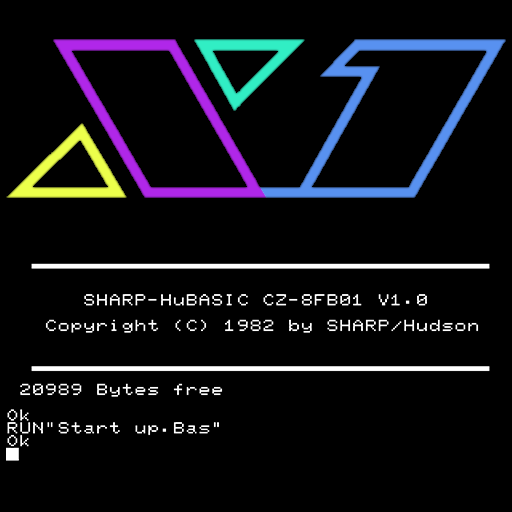
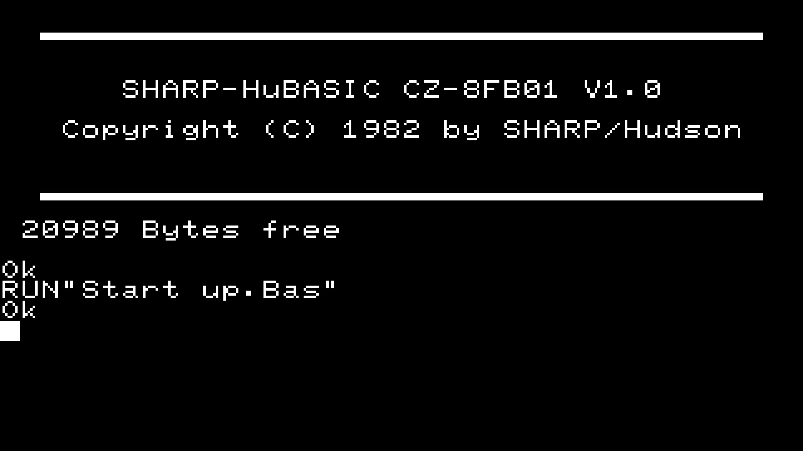

# Sharp X1 (X Millennium)

### Description

X millennium was born in the late 1990s as X1R, a real-time mode fork of X1EMU.

### License

BSD

### Icon

### Fanart

Help make me fanart!

### Screenshots

